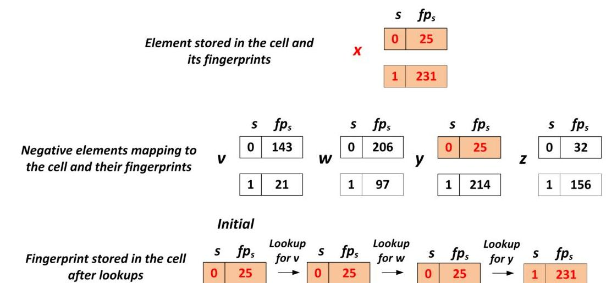
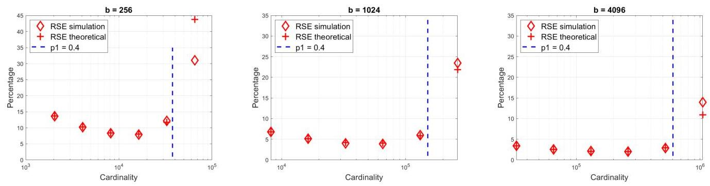

# Cardinality Estimation Adaptive Cuckoo Filters (CE-ACF): Approximate Membership Check and Distinct Query Count for High-Speed Network Monitoring 

Pedro Reviriego, Jim Apple, Alvaro Alonso, Otmar Ertl and Niv Dayan

#### Abstract

In network monitoring applications, it is often beneficial to employ a fast approximate set-membership filter to check if a given packet belongs to a monitored flow. Recent adaptive filter designs, such as the Adaptive Cuckoo Filter, are especially promising for such use cases as they adapt fingerprints to eliminate recurring false positives. In many traffic monitoring applications, it is also of interest to know the number of distinct flows that traverse a link or the number of nodes that are sending traffic. This is commonly done using cardinality estimation sketches. Therefore, on a given switch or network device, the same packets are typically processed using both a filter and a cardinality estimator. Having to process each packet with two independent data structures adds complexity to the implementation and limits performance.

This paper shows that adaptive cuckoo filters can also be used to estimate the number of distinct negative elements queried on the filter. In flow monitoring, those distinct queries correspond to distinct flows. This is interesting as we get the cardinality estimation for free as part of the normal adaptive filter's operation. We provide (1) a theoretical analysis, (2) simulation results, and (3) an evaluation with real packet traces to show that adaptive cuckoo filters can accurately estimate a wide range of cardinalities in practical scenarios.

Index Terms-Flow monitoring, Cardinality Estimation, Approximate Membership Checking, Adaptive Cuckoo Filters.

## I. INTRODUCTION

In many networking applications, there is a need to check whether an element belongs to a set. For example, each packet received by a switch or a router has to be checked against a potentially large routing table to determine the best matching entry (i.e. the longest matching prefix for IP and the exact matching destination MAC address for Ethernet). In network monitoring, it is of interest to track subsets of the flows ${ }^{1}$ that traverse a link at a given time. This is done for example
P. Reviriego is with Universidad Politécnica de Madrid, Av. Complutense 30, Madrid, Spain. Email: pedro.reviriego@upm.es.
J. Apple, Email: jbapple@jbapple.com.
A. Alonso is with Universidad Politécnica de Madrid, Av. Complutense 30, Madrid, Spain. Email: alvaro.alonso@upm.es.
Otmar Ertl is affiliated with Dynatrace Research, Linz, Austria. Email: otmar.ertl@dynatrace.com.
N. Dayan is with University of Toronto, Canada, Email:nivdayan@cs.toronto.edu.

[^0]to count the number of bytes or packets belonging to flows with certain characteristics (e.g., subject to significant traffic or originating in a given set of IP addresses [1]). Determining set membership can be done by storing the full keys in a hash table [2],[3], yet this can be costly in terms of memory footprint and bandwidth.

Switching ASICs have a limited amount of on-chip memory (e.g. SRAM) that is fast and a much larger external memory (e.g. DRAM) that is slower and has bandwidth limitations [4]. At the same time, each key (i.e., a 5-tuple) consists of 104 and 296 bits in IPv4 and IPv6, respectively. Hence, storing a hash table with the full keys on-chip is too costly in terms of memory. On the other hand, storing it in the slower external memory and checking it for every packet (including ones that are not being tracked) can create a performance bottleneck. This problem is also commonly found in database applications, where the keys that identify data entries are often too large and numerous to be stored and quickly checked against in faster memory (i.e., in this case, DRAM). On the other hand, having to search storage (i.e., disk or SSD) for each queried key can lead to a performance bottleneck [5], [6], [7], [8].

A common solution to this problem is to first perform a quick approximate check if the element is in the set [9]. Only on a positive outcome, a full check for the existence of the key in external memory is needed. Hence, when the application queries for non-existing keys, many accesses to external memory are avoided [10],[11]. This significantly alleviates the bottleneck on the external memory interface and reduces the use of on-chip memory. This quick approximate membership check is implemented with probabilistic data structures commonly referred to as filters. Many different types of filters have been proposed over the years from the classical Bloom filter [12] to the more recent cuckoo [13], xor [14], quotient [15], [16], [17], and ribbon [18] filters. These filters cannot return false negatives but do return false positives. Therefore, they can be used to perform a fast and low-cost check when many queries are negative to safely discard them from further processing [10]. The probability of a false positive depends on the amount of memory allocated to the filter and the number of elements it stores. It can typically be estimated analytically. The different filters offer different trade-offs in terms of their false positive probability, performance, and memory footprint, among other features [19].

Recently, adaptive filters have been proposed to react to a

[^0]:    ${ }^{1}$ A flow is defined as a group of packets that have the same 5-tuple formed by the source and destination IP addresses and ports and the protocol used. This typically corresponds to an exchange of information between two endpoints.

false positive when querying for some element $x$ by modifying the filter such that subsequent queries for $x$ return a negative [20]. Such adaptation is useful in skewed query distributions, whereby the same key may be repeatedly queried for and result in a false positive each time. In flow processing, for instance, each flow consists of many packets, and it is therefore desirable to prevent future false positives on the rest of the packets once the first false positive has occurred. Adaptive filters based on quotient [21], Bloom [22] and cuckoo filters [23] have been proposed and shown to dramatically reduce the false positive rate in packet processing applications and beyond.

In network monitoring, another feature that is of interest is knowing the number of distinct flows on a link or the number of distinct active nodes in a network [24],[25]. This is useful, for example, in detecting early Distributed Denial of Service Attacks (DDoS) or other anomalies in the traffic [26]. Similarly, in database workload monitoring, it is desirable to measure the size of the set of distinct queries. This is useful not only for security and anomaly detection [27] but also for deriving business insight. For instance, in online search, it is desirable to monitor the number of distinct search terms to gauge user behavior over time [28].

Computing the exact number of distinct elements on a large set can be costly in terms of memory and computation. To reduce the cost, many cardinality estimation algorithms have been proposed that provide good estimates while using a small memory footprint and simple operations [29]. For example, the HyperLogLog (HLL) estimator is widely used in both computing [28] and networking applications [30] and can provide estimates that deviate by less than $1 \%$ from the real value using only a few kilobytes of memory [31]. Cardinality estimators typically hash each key to an array of approximate counters, which are used to compute the cardinality estimate.

Overall, we observe that many network devices have to apply 1) approximate membership checking and 2) cardinality estimation on the same set of packets. If independent data structures are used for each function, each packet has to be processed twice. Furthermore, enough memory has to be allocated to both data structures to provide low error guarantees. This poses a challenge for high-speed switches that have limited on-chip memory and have to process hundreds of millions of packets per second [4]. For such applications, reducing the number of memory accesses needed per packet and the memory footprint is highly desirable.

This paper shows that carefully configured adaptive cuckoo filters can surprisingly be used to estimate the cardinality of the negative elements queried on the filter as part of their normal operation. In particular, a cardinality estimate can be computed from the contents of the filter without introducing any modification to its structure, memory footprint, or operations. The cardinality estimate is accurate except for very small or very large values, thus covering the cardinality values of many practical use cases. This means that adaptive cuckoo filters provide cardinality estimation for free. This paper shows how to derive cardinality estimations from an adaptive cuckoo filter and evaluate the accuracy of the results. Specifically, we make the following contributions:

1) Showing that the contents of adaptive cuckoo filters in some configurations contain information about the cardinality of the set of negative queries done on the filter.
2) Presenting a cardinality estimator that uses the filter contents to estimate cardinality.
3) Analyzing theoretically the proposed filter-based cardinality estimator.
4) Evaluating by simulation the proposed filter-based cardinality estimator.
5) Discussing how cardinality estimation may also be implemented in other adaptive filters.
The rest of the paper is organized as follows. Section II provides the background on adaptive cuckoo filters and cardinality estimators. The proposed cardinality estimation approach using an adaptive cuckoo filter is presented and analyzed in section III and evaluated using simulation in section IV. We provide a guideline for how to generalize the approach to other adaptive filters in section V.

## II. Preliminaries

This section briefly describes adaptive cuckoo filters and discusses existing cardinality estimation algorithms.

## A. Adaptive cuckoo filters (ACFs)

In many applications for which approximate membership checking is used, the workload is skewed with a few elements being checked repeatedly. In networking, for instance, a significant part of the traffic is concentrated on a few flows [32]. This means that when a false positive occurs for one of those frequently checked elements, many more false positives are likely to follow as subsequent checks are made to the same element. This has led to the development of adaptive filters [20] such as the adaptive cuckoo filter [23]. Such filters, upon detecting a false positive, adapt their contents so that future queries to the same element do not result in more false positives.

An adaptive cuckoo filter stores a fingerprint for each key within a cuckoo filter in fast memory while storing the full keys within a cuckoo hash table in slower memory. The cuckoo filter and cuckoo hash table have the same number of buckets and cells per bucket, and there is a one-to-one correspondence between their contents: if cell $j$ within bucket $i$ of the cuckoo filter stores a fingerprint for key $x$, then cell $j$ within bucket $i$ of the cuckoo hash table stores the full key $x$. Insertions and removals are done using cuckoo hashing in the filter, while full keys are moved in the cuckoo hash table to mirror the cuckoo filter's contents. This mirrored design allows to retrieve the key associated with any fingerprint. When a false positive occurs, the full key associated with the falsely matching fingerprint is retrieved from the cuckoo hash table, and an alternative hash function is used to generate a new fingerprint for it. The filter maintains some extra metadata to record which hash function was used to generate each fingerprint. During a query, this allows comparing a key in question to a fingerprint using the correct hash function. After adapting a fingerprint, it is very unlikely that the new fingerprint will still match the queried key after a different hash function is applied. In this way,

# Main cuckoo hash tables with the full keys 

Fig. 1. Illustration of the four table ACF configuration with one bit fingerprint selector. A lookup for element $x$ is being done on the ACF. The four hash functions $h_{1}, h_{2}, h_{3}, h_{4}$ are computed for $x$ and those positions are read on each table respectively. Then the selector bit $s$ is used to select the fingerprint $f p_{0}(x)$ or $f p_{1}(x)$ to use in the comparison with the fingerprint stored on each table. The entry on the third table will match the fingerprint and subsequently the main tables will be accessed. In this case $x$ is stored in the main tables and thus is a true positive.
adaptive cuckoo filters eliminate recurring false positives for frequently queried keys.

Adaptive cuckoo filters are a natural fit for flow monitoring as the full key must be retrieved whenever a positive occurs in the filter. Hence, the overhead of retrieving the full key from slower memory in order to adapt a fingerprint does not constitute additional overhead. Furthermore, in flow monitoring and many other networking applications, the size of each full key is uniform (e.g., a 5-tuple) and so the keys align perfectly within the cells of the cuckoo hash table. Finally, an additional benefit is that cuckoo hashing is widely used in networking applications and implementable in hardware [3].

Adaptive Cuckoo filters are also a good match for modern database applications. For example, recent systems such as Aerospike [33] and FASTER [34] store data in a log-structured manner in storage (e.g., disk or flash), and they index the locations of data entries using a space-efficient filter in memory (e.g., DRAM). This filter contains a fingerprint for each entry and a pointer to the location for the entry in storage. Hence, in case of a positive fingerprint match, a query follows the pointer to storage to check if it points to the target entry. In this context, mirroring is unnecessary as the pointers to storage allow retrieving the original key for a falsely matching fingerprint so that it can be adapted. Since databases are often
subject to heavy-tailed query distributions, having the filter adapt to remove recurring false positives reduces tail latency.

Two adaptive cuckoo filter variants have been proposed. In the first one, the filter consists of two sub-tables and each bucket contains four cells. In the second design, the filter consists of four sub-tables and each bucket contains one cell [23]. In the first configuration, a different hash function is used for each of the cells and adaptation is implemented by moving elements from one cell to another within the same bucket. In the second design, additional metadata in the form of one or more selector bits record which hash function generated each fingerprint. When a false positive occurs, the value of the selector bits is modified to reflect the new hash function being used.

In this paper, only the four-table adaptive cuckoo filter configuration ${ }^{2}$ is used as our cardinality estimation method uses the selector bits that are only applicable to this configuration. We illustrate it in Figure 1. It is composed of the main cuckoo hash tables (top) that store the full keys and the filter itself (bottom). Both of these components are partitioned into four

[^0]
[^0]:    ${ }^{2}$ It may seem that this configuration has worse false positive probability than the two-table configuration, as it requires selector bits for adaptation. However, the false positive probability when no adaptation is used is lower (approximately half) in the four table configuration, so when using one selector bit both configurations have similar performance.

sub-tables, and the cuckoo hash table mirrors the contents of the cuckoo filter. Each sub-table is accessed using a different hash function $h_{i}()$ in the filter. We denote the number of selector bits per cell as $s_{b}$. Each cell of the filter stores a selector value $s$ and the fingerprint $f p_{s}(z)$ of an element $z$ is computed using the hash function that corresponds to the selector value $s$.

To search for key $x$ in the filter, positions $h_{i}(x)$ are read and the stored fingerprints are compared with $f p_{s}(x)$ using the value of $s$ stored on each position. If there is a match, a positive is returned. Otherwise, the result of the check is negative. Figure 1 illustrates the mappings for element $x$ that would match on the third table of the filter. If the filter returns a positive, the cuckoo hash table is checked. If the key is not found, then a false positive is detected. To prevent it from recurring, the value of $s$ and the fingerprint are changed in the filter for that key.

The false positive probability for a non-existing key that has not been queried before can be approximated by $\frac{d \cdot o}{d^{f}}$ where $d$ is the number of tables, $o$ the filter occupancy, and $f$ the fingerprint length in bits. This is the same as for the plain cuckoo filter. In contrast, the false positive rate on a set of recurring queries to non-existing keys is lower as the filter will adapt to remove false positives when they are detected [23].

When inserting a key, we may find that the positions it maps to on the four tables are already occupied. When that occurs, one of the stored elements is displaced to one of its three alternative locations. This process continues recursively until an empty cell is found as in cuckoo hashing. In the ACF, the movements are done in both the filter and the full cuckoo hash tables to keep the one to one relationship between cells in both data structures. This enables the adaptive cuckoo filter to reach an occupancy of 95% with very high probability. In networking applications, the number of insertions is typically much lower than the number of queries. For example, in flow monitoring, the number of insertions is equal to the number of flows being monitored. In contrast, the number of queries is equal to the number of packets across all flows that traverse the link. Hence, the number of queries is typically several orders of magnitude larger than the number of insertions. For this reason, swapping entries across buckets to find space has a comparatively lower overall overhead, and the performance bottleneck tends to be querying.

For a ACF with four sub-tables, the best performance on real packet traces is obtained when using a single selector bit [23]. Interestingly, the proposed cardinality estimation only is applicable to a single selector bit as will be discussed in section III. Therefore, in the rest of the paper we also assume that a single selector bit $s_{b}=1$ is used. In this case, two hash functions are used and thus two different fingerprints are supported for each key. In this case, the selector bit can be changed from 0 to 1 or from 1 to 0 . Note that as many queries are processed, several false positives can occur on a cell so that the value of the selector can switch back and forth. This configuration has a similar performance to that of the two table configurations when evaluated using packet traces. We refer the reader to the original ACF paper [23] for further details.

## B. Cardinality estimation algorithms

Estimating the number of distinct elements or cardinality of a set is needed in many computing [28] and networking applications [30]. In network monitoring, it is of interest to know the number of flows on a link, or in an online service to know the number of unique users. In database systems, it is often desirable to measure the number of distinct queries to non-existing keys, e.g., to ascertain whether data is missing and if so how much. Over the years, many cardinality estimation algorithms have been proposed [29]. These algorithms can drastically reduce the memory footprint and computing effort compared to an exact calculation. For example, estimates that are accurate to a few percent of the exact value over a wide range of cardinalities are achieved using only a few kilobytes of memory and hash computations per element. The general approach used in cardinality estimation algorithms is to map the elements to pseudo-random values and compute some statistics on those values. We describe the most popular cardinality estimation approaches below.

One of the simplest methods is the Linear Probabilistic Counting Array (LPCA) [35], also known as linear counting [29]. This approach maps each key to one bit in a bit vector, setting it from 0 to 1 or keeping it set to 1 . Cardinality is estimated based on the number of ones in the array. An LPCA is simple to implement. To achieve a good accuracy, however, some knowledge of the expected maximum cardinality is needed. Furthermore, the memory requirement is linear in the number of keys. This is a limitation when memory is scarce and the cardinality can take large values.

This has led to the development of more sophisticated algorithms that require a sublinear or even constant memory size for practical cardinality values. The $k$ minimum values sketch [36],[37] maps elements to hash values using a hash function and keeps the $k$ minimum hash values seen in the stream of data. Cardinality is estimated based on the largest of the $k$ hash values seen so far. This means that the memory footprint is independent of the number of elements in the set.

The HyperLogLog [31] and its predecessors (e.g., the LogLog [38]) map each element to multiple slots in an array of counters. Each counter stores the maximum number of leading zeroes across all hashes that have been mapped to it. Such designs significantly reduce the memory requirement. The HyperLogLog can estimate cardinality values for up to billions of elements using a constant array size with five bit counters. As a result, HyperLogLog is widely used in computing [28] and networking [30] applications. HyperLogLog has been implemented, for instance, in programmable data planes using P4 [39], [40] and is used by most major cloud providers. HyperLogLog is considered the state-of-the-art for cardinality estimation when reducing the memory footprint is the priority. In the rest of the paper, HyperLogLog is used as the baseline for evaluating our proposed CE-ACF in terms of cardinality estimation. Comparing against simpler algorithms such as LPCAs would show larger benefits. By comparing to HyperLogLog, the results presented in the paper represent a lower bound in terms of memory savings.

Recently, the use of machine learning has also been proposed for cardinality estimation, but it remains to be seen if it will become as widely used and achieves the accuracy and cost of existing solutions [41],[42].

## III. Cardinality Estimation with Adaptive Cuckoo Filters (CE-ACF)

This section first describes the cardinality estimation problem and the intuition of why adaptive cuckoo filters can be used to address it. Then, the proposed filter-based cardinality estimation algorithm is presented in detail and analyzed theoretically for the single selector bit $s_{b}$ configuration. For larger values of $s_{b}$, it is shown that the adaptation state depends on the number of elements and not only on the number of distinct elements and therefore the values of the selector bits cannot be used for cardinality estimation. Finally, we discuss (1) the potential of integrating the cardinality estimation with the filter versus the use of independent data structures, and (2) the implementation of the proposed scheme in different hardware platforms. The terms used throughout the paper are summarized in Table I.

## A. Problem statement and intuition

Consider a multiset of elements $S$ that is queried on an adaptive cuckoo filter. Let $N$ be the subset of $S$ formed by elements that have not been inserted into the filter. In this setting, we want to estimate the cardinality $C$ (i.e., the number of distinct elements) of the set $N$. This corresponds to a scenario in which an adaptive cuckoo filter is used to monitor a small fraction of the flows (that are thus inserted into the filter) that traverse the link (e.g., originating in a set of source IP addresses) and we also want to know the total number of active flows on the link. In this case, $S$ corresponds to all packets flowing through the link while $N$ corresponds to packets belonging to non-monitored flows. Since the number of monitored flows is known ${ }^{3}$, we want to estimate the number of flows in $N^{4}$.
The intuition for why an adaptive filter can estimate cardinality is that the filter state contains information about the number of distinct negative elements that had been queried for. For example, consider a cell in the filter that stores an $f$ bit fingerprint and one selection bit (initialized to zero) that determines the hash function used to compute the fingerprint. If no negative elements that map to this cell are queried, the selection bit would be zero. However, if one negative element is queried for, there would be approximately a probability of $\frac{1}{2^{f}}$ that it matches the stored fingerprint. In this case, adaptation would be triggered setting the selection bit to one. Note that querying again for the same element will not change the state of the filter. As more distinct negative elements are queried, the probability of adaptation increases. Therefore,

[^0]the values of the selector bits contain information about the number of distinct negative elements queried on the filter. A larger number of cells that have adapted would correspond to a larger cardinality.

## B. Estimating the cardinality

Let us consider an adaptive cuckoo filter with $d=4$ tables, each consisting of $b$ buckets with one cell per bucket. Each cell is formed by a selector bit $s$ and a fingerprint $f p_{s}(x)$ of $f$ bits. The filter is first loaded with a set of elements $T$ to reach an occupancy of $o$. Finally, a set of $S$ elements is queried on the filter of which $C$ are distinct negative elements belonging to the set $N$. At the end of this process, the probability that a fingerprint with a given cell has been adapted can be estimated as follows. The number of distinct elements that map to each cell can be approximated by $\frac{C}{b}$, which would typically be much larger than one. An example of the mappings to one of the cells is illustrated in Figure 2. In this case, adaptation is triggered when querying for element $y$. The more queries to non-existing elements that map to this cell, the larger is the probability of adaptation. In this case, no other negative elements match $f p_{1}(x)$, so the cell's selector bits will store $s=1$.

On average, the expected number of elements in $N$ that match a fingerprint in a given cell is $\frac{C}{b \cdot 2^{f}}$. When using the Poisson approximation [31], which assumes that the number of distinct elements is Poisson distributed, the probability of having $k$ distinct elements that match the initially stored fingerprint $f p_{i}(x)$ can be modeled as:

$$
P_{i}(k) \approx \frac{\left(\frac{C}{b \cdot 2^{f}}\right)^{k}}{k!} \cdot e^{-\frac{C}{b \cdot 2^{f}}}
$$

The probability that at least one element $y \in N$ matches a fingerprint $f p_{0}(x)$ in a given cell and triggers an adaptation is approximated as $1-P_{i}(0)$ in Equation 2.

$$
P_{\text {adapt }} \approx 1-e^{-\frac{C}{b \cdot 2^{f}}}
$$

Let us consider a cell for which there is a matching element $y_{0}$ for $f p_{0}(x)$ and another matching element $y_{1}$ for $f p_{1}(x)$. In this case, the final value of $s$ depends on which of the two elements is queried last on the filter. If the last one is $y_{0}$, then $s=1$. Conversely, if it is $y_{1}$, then $s=0$. This is illustrated in Figure 3 for different sequences of queries to elements $y_{0}$ and $y_{1}$.

As a result, the probability of having each value of $s$ would be approximately 0.5 . When there are $l_{0}$ and $l_{1}$ matching elements (not necessarily distinct) for the fingerprints $f p_{0}(x)$ and $f p_{1}(x)$, respectively, the probability of each value of $s$ would be different, being larger for $s=1$ when $l_{0}>l_{1}$. However, the probability of having $l_{0}$ and $l_{1}$ matching elements to $f p_{0}(x)$ and $f p_{1}(x)$, respectively, is the same as that of having matching $l_{1}$ and $l_{0}$ elements to $f p_{0}(x)$ and $f p_{1}(x)$, respectively. Therefore, considering both cases, the probabilities of having $s=0$ and $s=1$ are both approximately 0.5 . The only exception to this analysis is when both $l_{0}, l_{1}$ are zero. In this case, $s=0$. This further implies that the number of distinct elements mapping to those fingerprints must be zero as well.

[^0]:    ${ }^{3}$ Note that there is no need to estimate the number of elements that have been inserted into the filter as we can easily compute the exact value by just counting the number of flow insertions.
    ${ }^{4}$ Note that typically when a filter is used, the number of negative elements is larger than the number of positive elements, as this is the case where filters eliminate many external memory accesses and are therefore attractive.

TABLE I
SUMMARY OF NOTATION

| Symbol | Meaning |
| :--: | :--: |
| $b$ | Number of buckets per table in the filter |
| $d=4$ | Number of tables in the filter |
| $h_{i}$ | Hash function for table $i$ |
| $o$ | Occupancy of the filter (fraction) |
| $f$ | Number of fingerprint bits |
| $f p_{s}$ | Fingerprint function for selector bit value $s$ |
| $s_{b}$ | Number of selector bits |
| $s$ | Value of the selector bits |
| $T$ | Set of elements stored in the filter |
| $S$ | Elements queried on the filter |
| $N \subseteq S$ | Negative elements queried on the filter |
| $C$ | Cardinality of the negative elements queried on the filter |
| $P_{i}(j)$ | Probability of having $j$ distinct negative elements on $N$ that match $f_{i}(x)$ for element $x$ stored in a particular cell |
| $l_{0}, l_{1}$ | Number of elements matching the fingerprint when the selector bit is 0,1 in a given cell. |
| $p_{1}$ | Probability that the selector bit takes a value of 1 in a given the cell after a set of queries to the filter |
| $\hat{p}_{1}$ | Fraction of the selector bits with a value of 1 in the cells of the filter after a set of queries to the filter |
| $M$ | Number of counters in the HLL estimator |
| $c$ | Number of counter bits in each cell of the HLL estimator |

Fig. 2. Illustration of a cell that stores the fingerprint of element $x$ (top) and to which negative elements $v, w, y, z$ map to (middle). Element $y$ has the same fingerprint as $x$ when the selector bit is zero $(s=0)$. Therefore, after $y$ is queried (bottom right), the cell is adapted by setting $s=1$ and the fingerprint to 231 , for which there is no matching fingerprint on $v, w, y, z$.

Therefore, $P\left(l_{0}=0 \wedge l_{1}=0\right)=P_{0}(0) \cdot P_{1}(0) \approx e^{-\frac{2 \cdot c^{\prime}}{b \cdot 2 f}}$ using equation 1 and the probability $p_{1}=P(s=1)$ that a selector bit is set can be approximated by

$$
p_{1}=\frac{1}{2} \cdot\left(1-P\left(l_{0}=0 \wedge l_{1}=0\right)\right) \approx \frac{1}{2} \cdot\left(1-e^{-\frac{2 \cdot c^{\prime}}{b \cdot 2 f}}\right)
$$

By solving Equation 3 for $C$ and estimating $p_{1}$ as the fraction of selector bits that are set to 1 (denoted as $\hat{p}_{1}$ ), we obtain Equation 4.

$$
\hat{C}:=-b \cdot 2^{f-1} \cdot \ln \left(1-2 \cdot \hat{p}_{1}\right)
$$

We obtain a value for the parameter $\hat{p}_{1}$ using Equation 5 by traversing the filter, counting the number of occupied cells with $s=1$, and dividing by the number of occupied cells $d \cdot b \cdot o$.

$$
\hat{p}_{1}:=\frac{\text { number of occupied cells with } s=1}{d \cdot b \cdot o}
$$

This analysis is similar to the one of the Odd Sketch [43], which estimates similarity between sets rather than cardinality. Indeed, each cell of the filter is equivalent to a position of an Odd Sketch except that only approximately $\frac{1}{2 f}$ of the elements change the selector bit. Just as for the Odd Sketch, the approximations derived are not valid when $p_{1}$ approaches 0.5 (i.e., for very large cardinalities). Since $p_{1}$ approaches 0.5 as $C \rightarrow \infty$ and the estimator is only defined as long as $\hat{p}_{1}<0.5$, our estimation approach fails for very large cardinalities $C$. At the same time, for very small cardinalities, it is unlikely that any selector bit would be set. A large estimation error is therefore also expected also in this case. The next subsection analyzes the estimation error as a function of the cardinality.

## C. Accuracy

The estimator $\hat{p}_{1}$ corresponds to an estimator of the probability of a binomial distribution with $d \cdot b \cdot o$ trials for which

Examples of sequences of queries showing the evolution of the value of $s$

|  | $y_{0} y_{1} y_{0} y_{1}$ | $y_{0} y_{0} y_{0} y_{1}$ | $y_{0} y_{1} y_{0} y_{0}$ | $y_{1} y_{0} y_{1} y_{0}$ |
| :--: | :--: | :--: | :--: | :--: |
| s | 1 | 0 | 1 | 0 | s 1 | 1 | 1 | 0 | s 1 | 0 | 1 | 1 | s 0 | 1 | 0 | 1 |

Fig. 3. Illustration of a cell that stores the fingerprint of element $x$ and to which two negative elements $y_{0}$ and $y_{1}$ map to. Element $y_{0}$ has the same fingerprint as $x$ when the selector bit is zero $(s=0)$ and $y_{1}$ has the same fingerprint as $x$ when the selector bit is one $(s=1)$. Therefore, the value of the selector bit depends on the sequence of queries as shown in the figure. The last element queried of the pair $y_{0}$ and $y_{1}$ determines the final value of $s$ for the given cell.
the variance is known to be

$$
\operatorname{Var}\left(\hat{p_{1}}\right)=\frac{p_{1} \cdot\left(1-p_{1}\right)}{d \cdot b \cdot o} \approx \frac{1-e^{-\frac{4 \cdot C}{b \cdot 2^{f}}}}{4 \cdot d \cdot b \cdot o}
$$

Using the delta method [44], the variance of $\hat{C}$ can be approximated by Equation 7.

$$
\begin{aligned}
\operatorname{Var}(\hat{C}) \approx \operatorname{Var}\left(\hat{p_{1}}\right)\left(\frac{d p_{1}}{d C}\right)^{-2} & \approx \frac{1-e^{-\frac{4 \cdot C}{b \cdot 2^{f}}}}{4 \cdot d \cdot b \cdot o}\left(\frac{e^{-\frac{2 C}{b 2 f}}}{b 2^{f}}\right)^{-2} \\
& =\frac{4^{f-1} \cdot b \cdot\left(e^{\frac{2 C}{b 2 f}}-1\right)}{d \cdot o}
\end{aligned}
$$

As a consequence, the expected relative standard error (RSE) is roughly given by

$$
\mathrm{RSE}=\frac{\sqrt{\operatorname{Var}(\hat{C})}}{C} \approx \frac{\phi\left(\frac{\hat{C}}{b 2^{f}}\right)}{\sqrt{b \cdot d \cdot o}}
$$

with $\phi(x):=\frac{\sqrt{e^{4 x}-1}}{2 x}$. Since the function $\phi(x)$ is convex and has its minimum at $x_{\min } \approx 0.398$ with $\phi\left(x_{\min }\right) \approx 2.49$, the lowest estimation error is achieved for $C \approx 0.398 \cdot b \cdot 2^{f}$ where $\mathrm{RSE} \approx 2.49 / \sqrt{b \cdot d \cdot o}$. The values of $\phi(x)$ are shown in Figure 4. It can be observed how accuracy degrades as we move away from $x_{\min } \approx 0.398$ to either larger or lower values (cardinalities).

For $x \ll 1$ we can approximate $e^{4 x}-1 \approx 4 x$ and therefore $\phi(x) \approx \frac{1}{\sqrt{x}}$, which yields

$$
\mathrm{RSE} \approx \sqrt{\frac{2^{f}}{d \cdot o \cdot C}} \quad \text { for } C \ll b \cdot 2^{f}
$$

To better understand the accuracy of the proposed estimator, we compare it with HLL that has an estimation error of approximately $\mathrm{RSE} \approx 1.04 / \sqrt{M}$ where $M$ is the number of counters [31]. This means that on the optimal point, our estimator has the same accuracy as an HLL with $\frac{b \cdot d \cdot o}{5.73}$

Fig. 4. The Function $\phi(x)$. As we move away from the minimum in either direction, the function grows for both smaller and larger values of $x=\frac{C}{b 2^{f}}$.
counters, and the equivalent number of counters decreases as we move towards smaller or larger cardinalities. This is illustrated in Figure 5, which shows the number of counters of an HLL structure that achieves the same estimation error as our estimator as a function of the cardinality for a filter with $b=65536, d=4, f=8$ and $95 \%$ occupancy. It can be seen that our estimator is equivalent to an HLL with more than 5,000 counters over a large range of cardinality values.

In summary, our estimator achieves a good accuracy unless the cardinality is too small or too large compared to $b \cdot 2^{f}$. The first case is unusual for a filter that is used precisely when the negative queries are more frequent than the positives such that the cardinality of the negative queries is typically much larger

Fig. 5. Number of counters of an HLL structure with the same estimation error for a filter with $b=65536, d=4, f=8$ and $95 \%$ occupancy as a function of the cardinality.
than the number of elements stored in the filter. As for the second case, when the cardinality is very large, the benefits of adaptation are smaller as there are so many negatives per cell that the filter keeps adapting and does not reach a state where false positives can be eliminated. Therefore, our estimator covers the range of cardinalities in settings on which adaptive filters are of interest.

## D. Applicability to more than one selector bit $s_{b}>1$

Although it would seem that similar schemes could be used to estimate the cardinality for ACFs that use more than one selector bit $s_{b}>1$, that is not the case. The key insight is that when there are multiple selector bits, their values depend on the number of elements. Thus sets with the same distinct count but different numbers of elements would have different distributions of the selector bit values. This is best illustrated with an example. Suppose $s_{b}=2$ and that we have a given query set such that there is exactly one query falsely matching each of the four possible fingerprints (i.e., $l_{0}=l_{1}=l_{2}=l_{3}=1$ ). The probability of having a value of zero for the selector bits after this particular set has been queried in the filter would be that of those elements being queried in the order $l_{0}, l_{1}, l_{2}, l_{3}$ which is one of twenty-four possible permutations. Instead, if having the same distinct count, the number of elements is $l_{0}=l_{1}=l_{2}=l_{3}=1000$ or any large number, the probability would be closer to onefourth, and as the number of elements is increased when the number of distinct elements is kept constant, all selector states will become asymptotically equally likely. Therefore, the adaptation state depends not only on the distinct count of the elements but also on the number of elements and thus cannot be used to provide a meaningful estimator of the cardinality. This means that cardinality estimation can only be implemented when $s_{b}=1$.

## E. Benefits of Integrating Cardinality Estimation on the Filter

Table II models the speed of queries and cardinality estimations in terms of memory accesses across two baselines: an independent filter and Hyperloglog versus our integrated approach ${ }^{5}$. Integration reduces the cost of queries (which are the most frequent operations in our target application) as no Hyperloglog needs to be accessed. On the other hand, the cost of cardinality estimation is higher as all the filter cells have to be read compared to reading all the counters of a Hyperloglog. However, cardinality estimates are typically computed less frequently. Flow monitoring, for example, entails performing tens of millions of queries per second while the number of distinct flows may be estimated and reported only once or a few times per second. Therefore, the cost of computing the cardinality estimate is not an issue. The bottleneck is rather the query path. The last row of Table II further shows that our integrated approach saves memory as there is no Hyperloglog. In summary, the integration has benefits in terms of memory bandwidth and memory footprint compared to using an independent filter and cardinality estimator.

TABLE II
COMPARISON OF INTEGRATED AND INDEPENDENT Filtering and Cardinality Estimation. A filter with $d$ tables of $b$ buCKets of SIZE $f$ AND A CARDINALITY ESTIMATOR WITH $M$ COUNTERS OF SIZE $c$ ARE USED IN THE COMPARISON

| Parameter | Independent | Integrated |
| :--: | :--: | :--: |
| Memory Accesses per Query | $d+1$ | $d$ |
| Memory Accesses per Estimate | $M$ | $b \cdot d$ |
| Memory Footprint (bits) | $b \cdot d \cdot f+M \cdot c$ | $b \cdot d \cdot f$ |

## F. Implementation on Hardware Platforms

The proposed CE-ACF is not tied to any particular implementation platform, though additional benefits can arise on certain platforms. For example, on programmable data planes, implementing HyperLogLog requires additional Ternary Content Addressable Memory (TCAM) blocks to count the number of leading zeros. This entails additional complexity [39], which our design obviates as it can perform cardinality estimation without the use of a Hyperloglog.

Furthermore, our design is well aligned with the increasing use of cuckoo hashing in modern switches [2],[3] as it is also based on cuckoo hashing. The implementation of cuckoo hashing in hardware can be done efficiently both in ASICs [3] and in FPGAs [45]. In P4 programmable switches, swapping of elements during insertions may introduce a significant bandwidth overhead. However, recent works suggest that new higher level approaches to code the programs can reduce the swapping overhead so that its impact on the switch bandwidth is marginal [46]. Even without those optimizations, cuckoo filter variants have been successfully implemented in P4 programmable data planes [47], and so our design is applicable for such platforms as well.

[^0]
[^0]:    ${ }^{5}$ We assume the filter to be also an ACF to facilitate the comparison.

## IV. Evaluation

The proposed scheme has been implemented ${ }^{6}$ and tested in different configurations both with randomly generated data and with packet traces. The use of random data enables us to explore how different parameters affect the cardinality estimation while the packet traces are used as a case study to validate the proposed scheme for a flow monitoring application. Finally, the proposed CE-ACF is compared to an alternative solution using an ACF for filtering and a HyperLogLog for cardinality estimation.

## A. Synthetic data

In the first experiment, filters with $d=4, b=1024, f=$ $7,11, s=1$ have been created and filled up to $95 \%$ occupancy. Then, a set of $N$ elements taken randomly and uniformly from a set of $C$ unique elements is queried on the filter. Finally, cardinality is estimated using equation 4 . This process is repeated across 1000 experimental runs. The mean and relative standard error are then computed. This has been done for different values of $C$. In each run, each negative element is queried on average five times ${ }^{7}$. The results are shown in Figures 6 and 7. The vertical line in these figures corresponds to the cardinality for which $p_{1}=0.4$ (i.e., getting close to 0.5 of the cells having a selector bit with a value of one). These measurements, therefore, mark the start of the range of cardinalities for which the proposed estimator exhibits diminishing accuracy. It can be seen that the cardinality estimate has low relative deviation on the mean so it seems to have a small bias as discussed in [43]. Figure 7 shows that the relative standard error is small for a wide range of cardinality values. Finally, the theoretical estimate is accurate when the cardinality is below the cardinality that corresponds to $p_{1}=0.4$ as expected.

The second experiment explores the impact of the filter size on the accuracy of the estimator. To do so, filters with $d=4, b=256,1024,4096, f=7, s=1$ have been created and filled up to $95 \%$ occupancy. Then, the same procedure as that of the first experiment is carried out. The results are summarized in Figures 8 and 9. It can be clearly seen that as $b$ and thus the filter size increases, so does the accuracy of the estimator as predicted by equation 8 .

## B. Packet traces

To validate the proposed cardinality estimation in a realistic flow monitoring scenario, packet traces from CAIDA have been used. The traces have approximately $33.4,37.8$ and 32.6 million packets and $1,588,650,1,711,354,13,459,419$ flows respectively.

Filters with $d=4, b=1024, f=10,12,14,16, s=1$ have been constructed for each of the traces and filled with the first flows of each trace until a $95 \%$ occupancy is reached. Then, all packets on the trace are checked on the filter and

[^0]the cardinality is estimated based on the final filter state. The process has been repeated one hundred times using different hash functions.

The results are presented in Figures 10, 11. It can be observed that the estimates are accurate for the first two traces when the fingerprints have at least 12 bits. Instead for the third trace, 14 bits are needed to get accurate estimates as it has many more flows. This is consistent with the analysis presented in the previous section. These results confirm that the ACF can be used to estimate the cardinality of the negative elements queried on the filter provided that it is in the range estimated theoretically in the previous section, which depends on both $b$ and $f$.

## C. Comparison with alternative solutions

Finally, it is of interest to compare the proposed CE-ACF with the use of an independent filter and cardinality estimator. As discussed before, for the filter we use the same ACF and for the cardinality estimation a HyperLogLog. In more detail, we use $M=1024$ counters of $c=6$ bits. The main metrics for comparison are summarized in Table III. The ACFs have in both cases four tables of 1024 buckets and fingerprints of 14 bits. The memory accesses and hash functions are for negative queries, which are dominant in filter workloads. The use of the CE-ACF provides significant savings in both the memory bandwidth needed and the number of hash functions. The savings in memory footprint are smaller but not negligible.

Additionally, the three packet traces have been processed using the proposed CE-ACF and an independent ACF and HLL from Apache DataSketches ${ }^{8}$. All packets are queried on the filter and the estimation of the cardinality is run every second. The samples were run 10 times and the average speed was taken. ${ }^{9}$ The run times for each trace are shown in Table IV. It can be observed that the proposed CE-ACF reduces the time needed significantly. This confirms that the savings in the per packet processing when using a single data structure are much larger than the increase in computing the cardinality estimates. In summary, these results confirm that the CEACF is attractive for efficient implementation high-speed flow monitoring applications.

TABLE III
COMPARISON OF THE PROPOSED CE-ACF WITH AN INDEPENDENT ACF AND HLL FOR DIFFERENT METRICS

|  | Memory accesses | Hash functions | Memory |
| :--: | :--: | :--: | :--: |
| Independent ACF and HLL | 5 | 8 | 68 Kb |
| Proposed CE-ACF | 4 | 6 | 61 Kb |
| Savings | $20 \%$ | $25 \%$ | $9.1 \%$ |

## V. CONCLUSION AND FUTURE WORK

In this paper, we have shown that adaptive cuckoo filters can be used to estimate cardinality as part of their normal operation. In more detail, the values of the selector bit in the filter contain information on the cardinality of the set

[^1]
[^0]:    ${ }^{6}$ The code is available at https://github.com/aalonsog/ACF/tree/cestimate/ reverse
    ${ }^{7}$ Note that the number of times that elements are queried on the filter should not affect the cardinality estimate.

[^1]:    ${ }^{8}$ https://datasketches.apache.org/
    ${ }^{9}$ The experiments were run on an Intel Core i7-7800X running Ubuntu 18.04.6 LTS and Clang version 16.0.0.

Fig. 6. Results for the first experiment in terms of relative deviation from the true cardinality value of the mean estimate over all runs for $f=7$ (left) and $f=11$ (right). The cardinality that corresponds to $p_{1}=0.4$ is also shown for reference as a dotted vertical line. The estimate is much worse when that value is exceeded.

Fig. 7. Results for the first experiment in terms of the relative standard error (the relative standard error given by equation 8 is also shown as well as the cardinality that corresponds to $p_{1}=0.4$ is also shown for reference as a dotted vertical line. The estimate is much worse when that value is exceeded.

Fig. 8. Results for the second experiment in terms of relative deviation from the true cardinality value of the mean estimate over all runs for $b=256$ (left), $b=1024$ (middle) and $b=4096$ (right).

Fig. 9. Results for the second experiment in terms of the relative standard error (the theoretical value of the relative standard error given by equation 8 is also shown as well as the cardinality that corresponds to $p_{1}=0.4$ for reference) for $b=256$ (left), $b=1024$ (middle) and $b=4096$ (right).

Fig. 10. Results for the CAIDA traces in terms of the average of the cardinality estimates. The true cardinality is also shown for reference. Trace 1 (left), Trace 2 (middle) and Trace 3 (right).

Fig. 11. Results for the CAIDA traces in terms of the relative standard error (the theoretical value of the relative standard error given by equation 8 is also shown). Trace 1 (left), Trace 2 (middle) and Trace 3 (right).

#### TABLE IV

**TIME (IN SECONDS) NEEDED TO PROCESS THE PACKET TRACES WITH THE CE-ACF VS AN INDEPENDENT ACF AND HILL.**

|  Trace | ACF+HILL | CE-ACF | Savings  |
| --- | --- | --- | --- |
|  Trace 1 | 1.82 | 1.53 | 15.9%  |
|  Trace 2 | 1.76 | 1.44 | 18.1%  |
|  Trace 3 | 1.96 | 1.68 | 14.3%  |

of negative elements that have been checked in the filter. A cardinality estimator that uses that information has been proposed, analyzed, and evaluated, showing that it can provide accurate estimates over a wide range of cardinality values. This is of interest for applications on which both approximate membership check and cardinality estimation are needed as both functions can be implemented in a single data structure, reducing memory and computing overheads.

The intuition that led to this paper, namely that the state of an adaptive cuckoo filter can be used to estimate cardinality of the negative elements queried on the filter, is applicable to adaptive filters in general. This is because an adaptation happens when a false positive is detected and removed, and thus adaptations can be used to estimate the number of distinct false positives and thus of elements. Therefore, deriving cardinality estimators for other adaptive filters like the Telescoping [21] or adaptive one memory access Bloom filters [22] is an interesting direction for future work.

## VI. ACKNOWLEDGEMENTS

Pedro Reviriego would like to acknowledge the support of the ACHILLES project PID2019-104207RB-I00 and the 6G-INTEGRATION-3 project TSI-063000-2021-127 funded by the Spanish Agencia Estatal de Investigacion (AEI) 10.13039/501100011033.

## REFERENCES

[1] R. Hofstede, P. Čeleda, B. Trammell, I. Drago, R. Sadre, A. Sperotto, and A. Pras, "Flow monitoring explained: From packet capture to data analysis with netflow and ipfix," IEEE Communications Surveys \& Tutorials, vol. 16, no. 4, pp. 2037-2064, 2014.
[2] D. Zhou, B. Fan, H. Lim, M. Kaminsky, and D. G. Andersen, "Scalable, high performance ethernet forwarding with cuckooswitch," in Proceedings of the Ninth ACM Conference on Emerging Networking Experiments and Technologies, ser. CoNEXT '13. New York, NY, USA: Association for Computing Machinery, 2013, p. 97-108. [Online]. Available: https://doi.org/10.1145/2535372.2535379
[3] G. Levy, S. Pontarelli, and P. Reviriego, "Flexible packet matching with single double cuckoo hash," IEEE Communications Magazine, vol. 55, no. 6, pp. 212-217, 2017.
[4] D. Kim, Z. Liu, Y. Zhu, C. Kim, J. Lee, V. Sekar, and S. Seshan, "Tea: Enabling state-intensive network functions on programmable switches," in Proceedings of the Annual conference of the ACM Special Interest Group on Data Communication on the applications, technologies, architectures, and protocols for computer communication, 2020, pp. 90-106.
[5] N. Dayan, M. Athanasoulis, and S. Idreos, "Monkey: Optimal Navigable Key-Value Store," in ACM SIGMOD, 2017.
[6] N. Dayan and S. Idreos, "Dostoevsky: Better space-time trade-offs for LSM-tree based key-value stores via adaptive removal of superfluous merging," in Proceedings of the 2018 International Conference on Management of Data, 2018, pp. 505-520.
[7] ——, "The log-structured merge-bush \& the wacky continuum," in Proceedings of the 2019 International Conference on Management of Data, 2019, pp. 449-466.
[8] N. Dayan and M. Twitto, "Chucky: A succinct cuckoo filter for lsm-tree," in Proceedings of the 2021 International Conference on Management of Data, 2021, pp. 365-378.
[9] S. Dharmapurikar, P. Krishnamurthy, and D. Taylor, "Longest prefix matching using Bloom filters," IEEE/ACM Transactions on Networking, vol. 14, no. 2, pp. 397-409, 2006.
[10] L. Luo, D. Guo, R. T. B. Ma, O. Rottenstreich, and X. Luo, "Optimizing Bloom filter: Challenges, solutions, and comparisons," IEEE Communications Surveys and Tutorials, vol. 21, no. 2, pp. 1912-1949, 2019.
[11] S. Pontarelli, P. Reviriego, and M. Mitzenmacher, "EMOMA: Exact match in one memory access," IEEE Transactions on Knowledge and Data Engineering, vol. 30, no. 11, pp. 2120-2133, 2018.
[12] B. Bloom, "Space/time tradeoffs in hash coding with allowable errors," Communications of the ACM, vol. 13, no. 7, 1970.
[13] B. Fan, D. G. Andersen, M. Kaminsky, and M. D. Mitzenmacher, "Cuckoo filter: Practically better than Bloom," in ACM CoNEXT, 2014.
[14] T. M. Graf and D. Lemire, "Xor filters: Faster and smaller than bloom and cuckoo filters," ACM J. Exp. Algorithmics, vol. 25, Mar. 2020. [Online]. Available: https://doi.org/10.1145/3376122
[15] M. A. Bender, M. Farach-Colton, R. Johnson, B. C. Kuszmaul, D. Medjedovic, P. Montes, P. Shetty, R. P. Spillane, and E. Zadok, "Don't thrash: how to cache your hash on flash," in 3rd Workshop on Hot Topics in Storage and File Systems (HotStorage 11), 2011.
[16] P. Pandey, M. A. Bender, R. Johnson, and R. Patro, "A general-purpose counting filter: Making every bit count," in Proceedings of the 2017 ACM international conference on Management of Data, 2017, pp. 775787.
[17] P. Pandey, A. Conway, J. Durie, M. A. Bender, M. Farach-Colton, and R. Johnson, "Vector quotient filters: Overcoming the time/space tradeoff in filter design," in Proceedings of the 2021 International Conference on Management of Data, 2021, pp. 1386-1399.
[18] P. C. Dillinger, L. Hübschle-Schneider, P. Sanders, and S. Walzer, "Fast Succinct Retrieval and Approximate Membership using ribbon," in 20th Symposium on Experimental Algorithms (SEA), 2022, best paper award, full paper at https://arxiv.org/abs/2109.01892.
[19] P. C. Dillinger and S. Walzer, "Ribbon filter: practically smaller than bloom and xor," CoRR, vol. abs/2103.02515, 2021. [Online]. Available: https://arxiv.org/abs/2103.02515
[20] M. A. Bender, M. Farach-Colton, M. Goswami, R. Johnson, S. McCauley, and S. Singh, "Bloom filters, adaptivity, and the dictionary problem," in IEEE Symposium on Foundations of Computer Science (FOCS), 2018.
[21] D. J. Lee, S. McCauley, S. Singh, and M. Stein, "Telescoping filter: A practical adaptive filter," in ESA, 2021.
[22] P. Reviriego, A. Sánchez-Macián, O. Rottenstreich, and D. Larrabeiti, "Adaptive one memory access bloom filters," IEEE Transactions on Network and Service Management, pp. 1-1, 2022.
[23] M. D. Mitzenmacher, S. Pontarelli, and P. Reviriego, "Adaptive cuckoo filters," in Workshop on Algorithm Engineering and Experiments (ALENEX), 2018.
[24] L. Zheng, D. Liu, W. Liu, Z. Liu, Z. Li, and T. Wu, "A data streaming algorithm for detection of superpoints with small memory consumption," IEEE Communications Letters, vol. 21, no. 5, pp. 1067-1070, May 2017.
[25] Q. Xiao, S. Chen, Y. Zhou, M. Chen, J. Luo, T. Li, and Y. Ling, "Cardinality estimation for elephant flows: A compact solution based on virtual register sharing," IEEE/ACM Transactions on Networking, vol. 25, no. 6, pp. 3738-3752, 2017.
[26] D. Ding, M. Savi, F. Pederzolli, M. Campanella, and D. Siracusa, "Innetwork volumetric DDoS victim identification using programmable commodity switches," IEEE Transactions on Network and Service Management, vol. 18, no. 2, pp. 1191-1202, 2021.
[27] A. Sallam, D. Padiolalkarim, E. Bertino, and Q. Xiao, "Data and syntax centric anomaly detection for relational databases," Wiley interdisciplinary reviews: data mining and knowledge discovery, vol. 6, no. 6, pp. 231-239, 2016.
[28] S. Heule, M. Nunkesser, and A. Hall, "HyperLogLog in Practice: Algorithmic Engineering of a State of the Art Cardinality estimation algorithm," in Proceedings of the 16th International Conference on Extending Database Technology, ser. EDBT '13. New York, NY, USA: Association for Computing Machinery, 2013, p. 683-692. [Online]. Available: https://doi.org/10.1145/2452376.2452456
[29] H. Harmouch and F. Naumann, "Cardinality estimation: An experimental survey," Proc. VLDB Endow., vol. 11, no. 4, p. 499-512, dec 2017. [Online]. Available: https://doi.org/10.1145/3186728.3164145
[30] M. Kadosh, G. Levy, Y. Shpigelman, O. Shabtai, Y. Piasetzky, and L. Mula, "Cardinality-based traffic control," Dec. 1 2022, uS Patent App. 17/335,312.
[31] P. Flajolet, E. Fusy, O. Gandouet, and et al., "Hyperloglog: The analysis of a near-optimal cardinality estimation algorithm," in International Conference on Analysis of Algorithms (AOFA), 2007.
[32] L. Guo and I. Matta, "The war between mice and elephants," in Proceedings Ninth International Conference on Network Protocols. ICNP 2001, 2001, pp. 180-188.
[33] V. Srinivasan, B. Bulkowski, W.-L. Chu, S. Sayyaparaju, A. Gooding, R. Iyer, A. Shinde, and T. Lopatic, "Aerospike: Architecture of a realtime operational dbms," Proc. VLDB Endow., vol. 9, no. 13, pp. 13891400, 2016.
[34] B. Chandramouli, G. Prasaad, D. Kossmann, J. Levandoski, J. Hunter, and M. Barnett, "Faster: A concurrent key-value store with in-place updates," in ACM International Conference on Management of Data (SIGMOD), 2018.
[35] K.-Y. Whang, B. T. Vander-Zanden, and H. M. Taylor, "A linear-time probabilistic counting algorithm for database applications," ACM Trans. Database Syst., vol. 15, no. 2, pp. 208-229, 1990. [Online]. Available: https://doi.org/10.1145/78922.78925
[36] F. Giroire, "Order statistics and estimating cardinalities of massive data sets," Discrete Applied Mathematics, vol. 157, no. 2, pp. 406 - 427, 2009. [Online]. Available: http://www.sciencedirect.com/science/article/ pii/S0166218X08002813
[37] Z. Bar-Yossef, T. S. Jayram, R. Kumar, D. Sivakumar, and L. Trevisan, "Counting Distinct Elements in a Data Stream," in Proceedings of the 6th International Workshop on Randomization and Approximation Techniques, ser. RANDOM '02. Berlin, Heidelberg: Springer-Verlag, 2002, p. 1-10.
[38] M. Durand and P. Flajolet, "Loglog counting of large cardinalities," in European Symposium on Algorithms (ESA), 2003.
[39] D. Ding, M. Savi, F. Pederzolli, and D. Siracusa, "INVEST: Flow-based Traffic Volume Estimation in Data-plane Programmable Networks," in 2021 IFIP Networking Conference (IFIP Networking), 2021, pp. 1-9.
[40] H. Namkung, D. Kim, Z. Liu, V. Sekar, and P. Steenkiste, "Telemetry retrieval inaccuracy in programmable switches: Analysis and recommendations," in Proceedings of the ACM SIGCOMM Symposium on SDN Research (SOSR), 2021, pp. 176-182.
[41] K. Kim, J. Jung, I. Seo, W.-S. Han, K. Choi, and J. Chong, "Learned cardinality estimation: An in-depth study," in Proceedings of the 2022

International Conference on Management of Data, ser. SIGMOD '22. New York, NY, USA: Association for Computing Machinery, 2022, p. 1214-1227. [Online]. Available: https://doi.org/10.1145/3514221. 3526154
[42] R. Cohen and Y. Nezri, "Cardinality estimation in a virtualized network device using online machine learning," IEEE/ACM Transactions on Networking, vol. 27, no. 5, pp. 2098-2110, 2019.
[43] M. Mitzenmacher, R. Pagh, and N. Pham, "Efficient estimation for high similarities using odd sketches," 04 2014, pp. 109-118.
[44] G. Casella and R. L. Berger, Statistical Inference, 2nd ed. Pacific Grove, CA: Duxbury, 2002.
[45] S. Pontarelli, R. Bifulco, M. Bonola, C. Cascone, M. Spaziani, V. Bruschi, D. Sanvito, G. Siracusano, A. Capone, M. Honda, F. Huici, and G. Siracusano, "FlowBlaze: Stateful Packet Processing in Hardware," in 16th USENIX Symposium on Networked Systems Design and Implementation (NSDI 19). Boston, MA: USENIX Association, Feb. 2019, pp. 531-548. [Online]. Available: https: //www.usenix.org/conference/nsdi19/presentation/pontarelli
[46] J. Sonchack, D. Loehr, J. Rexford, and D. Walker, "Lucid: A Language for Control in the Data Plane," in Proceedings of the 2021 ACM SIGCOMM 2021 Conference, ser. SIGCOMM '21. New York, NY, USA: Association for Computing Machinery, 2021, p. 731-747. [Online]. Available: https://doi.org/10.1145/3452296.3472903
[47] Q. Xiao, H. Wang, and G. Pan, "Accurately Identify Time-decaying Heavy Hitters by Decay-aware Cuckoo Filter along Kicking Path," in 2022 IEEE/ACM 30th International Symposium on Quality of Service (IWQoS), 2022, pp. 1-10.

Pedro Reviriego received the M.Sc. and Ph.D. degrees in telecommunications engineering from the Technical University of Madrid, Madrid, Spain, in 1994 and 1997, respectively. From 1997 to 2000, he was an Engineer with Teldat, Madrid, working on router implementation. In 2000, he joined Massana to work on the development of 1000BASET transceivers. From 2004 to 2007, he was a Distinguished Member of Technical Staff with the LSI Corporation, working on the development of Ethernet transceivers. From 2007 to 2018 he was with Nebrija University, from 2018 to 2022 with Universidad Carlos III de Madrid. He is currently with Universidad Politécnica de Madrid working on probabilistic data structures, high speed packet processing and machine learning.

Jim Apple received his M.S. in computer and information science from the University of Oregon. His current research interests include hashing and hashing-based data structures.

Álvaro Alonso received the M.Sc. and Ph.D. degrees in telecommunications engineering from the Universidad Politécnica de Madrid, Spain, in 2013 and 2016, respectively. He is currently an Associate Professor with Universidad Politécnica de Madrid. His main research interests are Public Open Data, Security Management in Smart Context environments, and Multivideoconferencing Systems.

Otmar Ertl is a Lead Researcher at Dynatrace Research. He received the Ph.D. degree in technical sciences from the Vienna University of Technology in 2010. His current research interests include probabilistic algorithms and data structures.

Niv Dayan is an Assistant Professor at the University of Toronto. Prior to that, he was a Research Scientist at Pliops and a Postdoc at Harvard. Niv received his M.Sc. and Ph.D. from the IT University of Copenhagen. His current research interests include the design and analysis of storage engines and their core data structures.